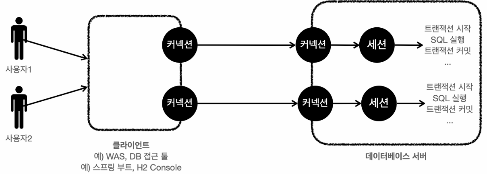

## 트랜잭션(Transaction)
데이터베이스에 데이터를 저장하는 대표적인 이유는 트랜잭션이라는 개념을 지원하기 때문이다.

예를 들어 A가 B한테 5,000원을 송금한다면 A의 잔액이 5000원 줄고, B의 잔액이 5000원 늘어나야한다.
이러한 거래는 2가지 작업은 하나의 작업처럼 동작해야한다.
한 작업은 성공하고 다른 작업은 실패했을 때 심각한 문제가 발생하기 때문이다. 

이럴 때 데이터베이스의 트랜잭션 기능을 사용하면 거래 중 문제가 발생하면 거래 이전으로 돌아갈 수 있다.
거래가 성공하여 데이터베이스에 정상 반영되는 것을 **커밋(Commit)**, 하나라도 실패하여 이전으로 돌아가는 것을 **롤백(Rollback)** 이라고 한다.

### 트랜잭션 ACID
트랜잭션 ACID라 하는 **Atomicity(원자성)**, **Consistency(일관성)**, **Isolation(격리성)**, **Durability(지속성)** 을 보장해야한다.

- **원자성**: 트랜잭션 내에서 실행한 작업들은 마치 하나의 작업인 것처럼 모두 성공하든가 모두 실패해야 한다.
- **일관성**: 모든 트랜잭션은 일관성 있는 데이터베이스 상태를 유지해야 한다.
- **격리성**: 동시에 실행되는 트랜잭션들이 서로에게 영향을 미치지 않도록 격리한다.
- **지속성**: 트랜잭션을 성공적으로 끝내면 그 결과가 항상 기록되어야 한다. 중간에 시스템에 문제가 발생해도 데이터베이스 로그 등을 사용해서 성공한 트랜잭션 내용을 복구해야 한다.

트랜잭션은 원자성, 일관성, 지속성을 보장한다. 
문제는 격리성인데 트랙잭션간에 격리성을 완벽히 보장하려면 트랜잭션을 거의 차례대로 실행해야 한다. 
이럴 경우 동시성 처리 성능이 매우 나빠지기 떄문에 ANSI 표준은 트랜잭션의 **격리 수준(Isolation Level)** 을 4단계로 나누어 정의했다.

### 트랜잭션 격리 수준(Isolation Level)

**READ UNCOMMITED** 의 격리 수준이 가장 낮고 **SERIALIZABLE** 의 격리 수준이 가장 높다.  
격리 수준이 낮을수록 동시성은 증가하지만 격리 수준에 따른 다양한 문제가 발생한다.

#### 트랜잭션 격리 수준과 문제점
|격리 수준|DIRTY READ|NON-REPEATABLE READ|PHANTOM READ|
|---|:---:|:---:|:---:|
READ UNCOMMITED|O|O|O|
READ COMMITED||O|O|
REPEATABLE READ|||O|
SERIALIZABLE||||

- **READ UNCOMMITED**: 커밋하지 않은 데이터를 읽을 수 있다. 예를 들어 데이터를 수정하고 있는데 커밋하지 않아도 수정 중인 데이터를 조회할 수 있다. 이것을 **DIRTY READ** 라고 한다.
- **READ COMMITED**: 커밋된 데이터를 읽을 수 있다. 따라서 **DIRTY READ** 가 발생하지 않는다. 하지만 트랜잭션 1이 회원 A를 조회 중인데 갑자기 트랜잭션 2가 회원 A를 수정하고 커밋하면 트랜잭션 1이 다시 회원 A를 조회했을 때 수정된 데이터가 조회된다. 이처럼 반복해서 같은 데이터를 읽을 수 없는 상태를 **NON-REPEATABLE READ** 라고 한다.
- **REPEATABLE READ**: 한 번 조회한 데이터를 반복해서 조회해도 같은 데이터가 조회된다. 하지만 트랜잭션 1이 10살 이하의 회원을 조회했을 때 회원 하나가 추가된 상태로 조회된다. 이처럼 반복 조회 시 결과 집합이 달라지는 것을 **PHANTOM READ** 라고 한다.
- **SERIALIZABLE**: 가장 엄격한 격리 수준으로, 이름 그대로 트랜잭션을 순차적으로 진행시킨다. 동시성 처리 성능이 급격히 떨어질 수 있다.

애플리케이션 대부분은 동시성 처리가 중요하므로 데이터베이스들은 보통 READ COMMITED 격리 수준을 기본으로 사용한다.  
`트랜잭션 격리 수준에 따른 동작 방식은 데이터베이스마다 조금씩 다르다. 최근에는 데이터베이스들이 더 많은 동시성 처리를 위해 락보다는 MVCC(Multi-Version Concurrency Control)를 사용하므로 락을 사용하는 데이터베이스와 약간 다른 특성을 지닌다.`

### 데이터베이스 연결 구조와 세션

개발자가 클라이언트를 통해 SQL을 전달하면 현재 커넥션에 연결된 세션이 SQL을 실행한다. 세션은 트랜잭션을 시작하고, 커밋 또는 롤백을 통해 트랜잭션을 종료한다.

### 자동 커밋, 수동 커밋
- **자동 커밋**: 각각의 쿼리 실행 직후에 자동으로 커밋이 호출된다. 커밋 또는 롤백을 직접 호출하지 않아도 되는 편리함이 있지만 트랜잭션의 기능을 활용할 수 없다.
- **수동 커밋**: 커밋을 호출하기 전까진 데이터가 임시로 저장된다. 따라서 같은 세션에서만 변경 데이터가 보인다.

세션 내에서 자동, 수동 커밋의 설정은 변경하기 전까지 유지된다.

### 락(Lock)

#### 데이터 변경
세션 1이 트랜잭션을 시작하고 데이터를 변경경하는 동안 커밋을 수행하지 않았는데, 세션 2에서 동시에 같은 데이터를 변경하게 되면 여러가지 문제가 발생한다.
바로 트랜잭션의 원자성이 깨지는 것이다. 여기에 더해서 세션 1이 중간에 롤백을 하게 되면 세션 2는 잘못된 데이터를 변경하는 문제가 발생한다.  
이런 문제를 방지하기 위해 세션이 트랜잭션을 시작하고 데이터를 변경하는 동안에 커밋이나 롤백 전까지 다른 세션에서 해당 데이터를 변경할 수 없도록 **락(Lock)** 이라는 개념을 제공한다.  
**락(Lock)** 을 획득해야 데이터의 변경이 가능하기 때문에 변경하려는 데이터가 다른 세션에서 변경 중인 경우 **락(Lock)** 이 돌아올 떄까지 대기하고 락 대기 시간을 넘어가면 락 타임 아웃 오류를 발생시킨다.

#### 데이터 조회
데이터베이스마다 다르지만 보통 데이터를 조회할 때는 락을 획득하지 않고 바로 조회할 수 있다.

##### 조회 시점에 락이 필요한 경우
트랜잭션 종료 시점까지 해당 데이터를 다른 곳에서 변경하지 못하도록 강제로 막아야할 때가 있다. 이런 경우 `SELECT FOR UPDATE` 구문을 사용하면 된다.

#### 낙관적 락과 비관적 락
- **낙관적 락**: 트랜잭션 대부분은 충돌이 발생하지 않는다고 낙관적으로 가정하는 방법이다. 데이터베이스가 아닌 애플리케이션이 제공하는 락 기능을 사용한다. 대표적으로 JPA가 제공하는 버전 관리 기능이 있다
- **비관적 락**: 트랜잭션의 충돌이 발생한다고 가정하고 우선 락을 걸고 보는 방법이다. 데이터베이스가 제공하는 락 기능을 사용한다. 대표적으로 `SELECT FOR UPDATE` 구문이 있다.

### 두 번의 갱신 분실 문제(Second Lost Updates Problem)
A와 B가 동시에 같은 공지사항을 수정한다고 생각해보자. 둘이 동시에 수정 하면을 열어서 내용을 수정하는 중에 A가 먼저 수정완료 버튼을 눌렀다. 잠시 후에 B가 수정완료 버튼을 눌렀다. 결과적으로 먼저 수정된 A의 수정사항은 사라지고 B의 수정사항만 남게된다. 이것을 **두 번의 갱신 분실 문제(Second Lost Updates Problem)** 이라고 한다.  
이것은 트랜잭션만으로는 문제를 해결할 수 없다. 이 때는 3가지 선택 방법이 있다.

- 마지막 커밋만 인정하기
- 최초 커밋만 인정하기
- 충돌하는 갱신 내용 병합하기

기본은 마지막 커밋만 인정하기가 사용된다. 하지만 상황에 따라 최초 커밋만 인정하기가 더 합리적일 수 있다. JPA가 제공하는 버전 관리 기능을 사용하면 손쉽게 최초 커밋만 인정하기를 구현할 수 있다.  
충돌하는 갱신 내용 병합하기는 최초 커밋만 인정하기를 조금 더 우아하게 처리하는 방법인데 애플리케이션 개발자가 직접 사용자를 위해 병합 방법을 제공해야 한다.
