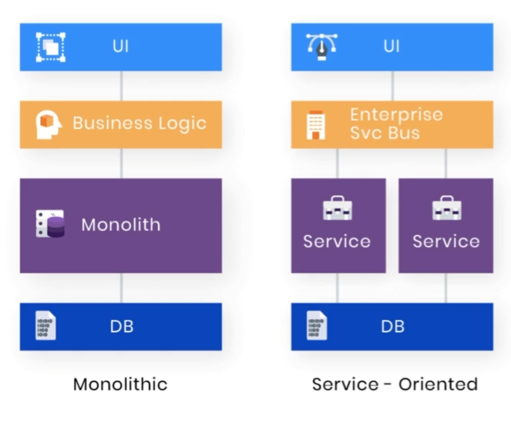
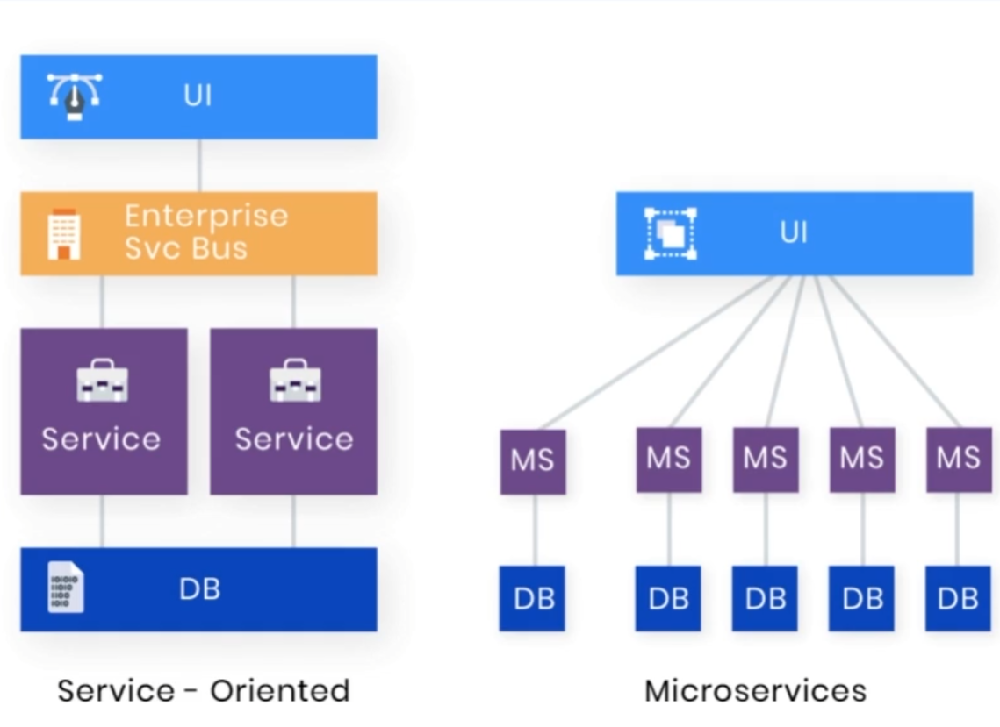

## Monolithic, Service-Oriented, Microservice Architecture

### Monolithic VS Service-Oriented

  

#### 공통점
- Shared DB를 사용한다.
- 원 코드 베이스
- 모듈/서비스 간 규격화된 호출 방식을 사용한다.

#### 차이점
- 독립적으로 배포할 수 있다.
- 비지니스 로직에 따라 어떤 서비스를 호출할 지 결정하는 Layer(Enterprise Service Bus)가 존재한다.
- 트랜잭션 구현을 별개로 해줘야한다.
- 동일 플랫폼(JVM 환경)에서 서비스 간 호출을 하다보니 성능에 이슈가 존재한다.

### Service-Oriented VS Microservice

  

#### 공통점
- 개발의 단위를 **서비스** 로 생각한다.
- 다른 서비스와 독립적으로 개발, 배포가 가능하다.

#### 차이점
- 비지니스 로직(서비스)의 재사용을 지양한다.
  - 서비스간 결합도록 낮추는 것이 목표다.
- 낮은 결합도로 변화에 애자일한 대응이 가능하다.
- 각 서비스는 각 서비스의 특성에 맞는 최적의 기술 스택을 독립적으로 선택 가능하다.
- 서비스 간 자유로운 방식으로 통신 가능하다.

### Microservice Architecture

#### Business Capabilities
- 조직이 얼마나 빠르고 유연하게 변화에 대응할 수 있는지에 대한 능력
- Monolithic, Service-Oriented 는 협업, 커뮤니케이션, 확장성, 유연성, 결합도, 응집도, 빌드와 배포 등의 문제로 해당 능력이 부족하다.
