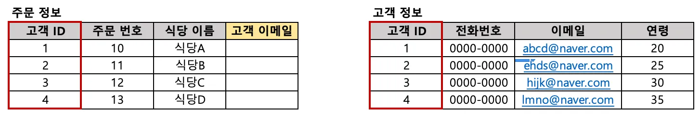
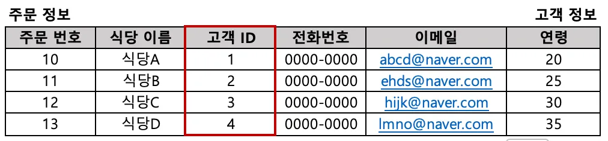
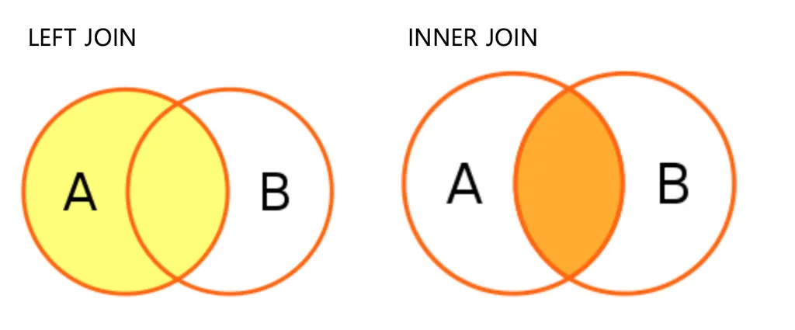
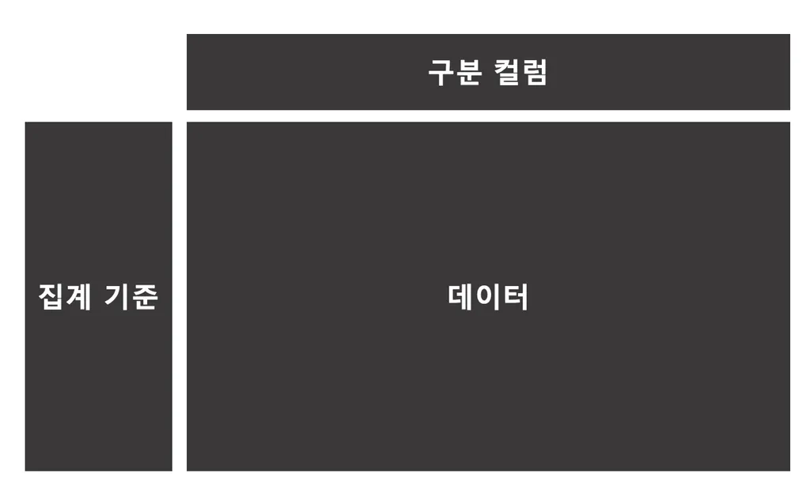
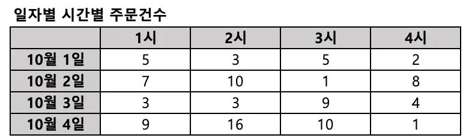
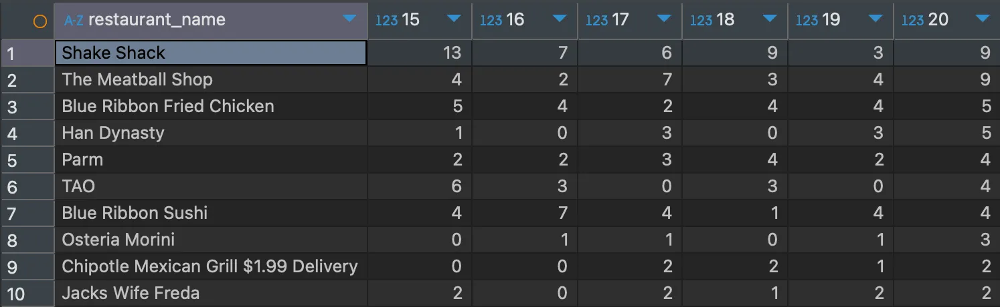
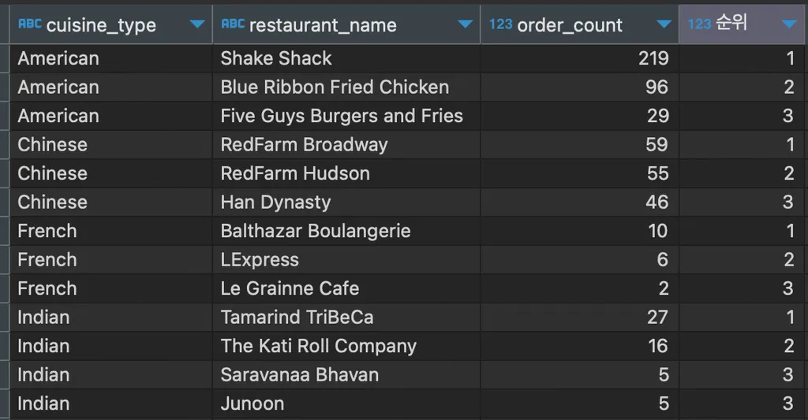
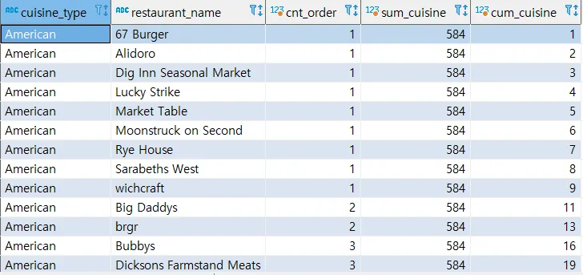
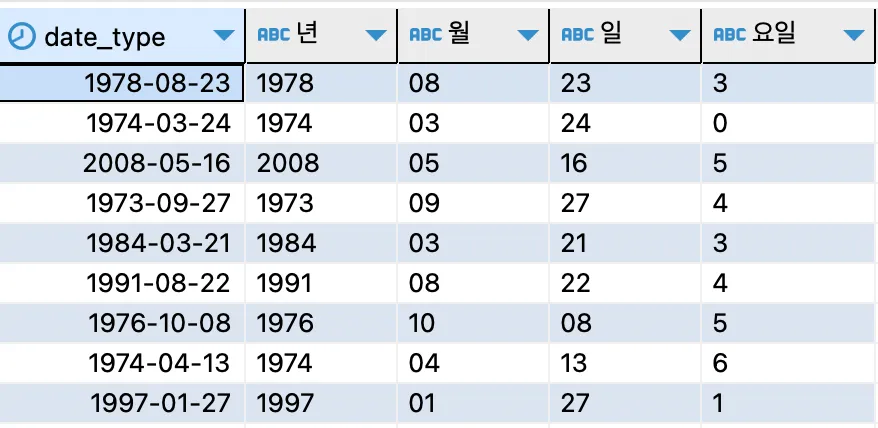
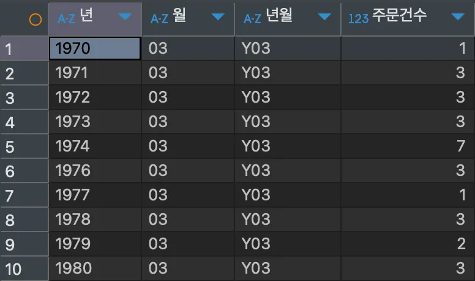

---
title: 사전캠프 6일차
description:
slug: nb-pre-til-6
date: 2025-01-20 00:00:00+0000
image:
weight: 1
categories:
    - til
tags:
    - 내일배움캠프
    - 사전캠프
---
## Subquery
여러 번의 연산을 한 번의 SQL 문으로 수행할 때 사용한다.

### 필요한 경우
- 여러 번의 연산을 수행할 떄
- 조건문에 연산 결과를 사용할 떄
- 조건에 Query 결과를 사용하고 싶을 때

### 기본 구조
``` sql
select column1, special_column
from
    ( /* subquery */
    select column1, column2 special_column
    from table1
    ) a
```

---

## Join
필요한 데이터가 서로 다른 테이블에 있을 때 조회하기 위해 사용한다.

### 기본 원리와 종류


- 공통 컬럼을 기준으로 두 테이블을 합쳐서, 각각 테이블에서 필요한 데이터를 조회할 수 있다.


- LEFT JOIN: 공통 컬럼을 기준으로, 하나의 테이블에 값이 없더라도 모두 조회
- INNER JOIN: 공통 컬럼을 기준으로, 두 테이블에 모두에 있는 값만 조회

### 기본 구조
```sql
-- LEFT JOIN
select 조회 할 컬럼
from 테이블1 a left join 테이블2 b on a.공통컬럼명=b.공통컬럼명

-- INNER JOIN
select 조회 할 컬럼
from 테이블1 a inner join 테이블2 b on a.공통컬럼명=b.공통컬럼명
```
- 공통 컬럼의 이름은 같을 필요가 없다. 

---

## 조회한 데이터에 값이 없다면
### 없는 값을 제외하기
``` sql
select restaurant_name,
       avg(rating) average_of_rating,
       avg(if(rating<>'Not given', rating, null)) average_of_rating2
from food_orders
group by 1
```

``` sql
select a.order_id,
       a.customer_id,
       a.restaurant_name,
       a.price,
       b.name,
       b.age,
       b.gender
from food_orders a left join customers b on a.customer_id=b.customer_id
where b.customer_id is not null 
```
### 다른 값을 대신 사용하기
- 데이터 분석의 경우 평균 값 혹은 중앙 값등을 대표 값으로 대체해주기도 함
- 방법
  - 다른 값이 있을 때 조건문 이용하기 : if(rating>=1, rating, 대체값)
  - null 값일 때 : coalesce(age, 대체값)

---

## 조회한 데이터가 상식적이지 않은 값이라면
조건문으로 값의 범위를 지정

``` sql
select customer_id, name, email, gender, age,
       case when age<15 then 15
            when age>80 then 80
            else age end "범위를 지정해준 age"
from customers
```

## SQL로 Pivot Table 만들어보기
Pivot Table: 2개 이상의 기준으로 데이터를 집계할 떄, 보기 쉽게 배열하여 보여주는 



### 실제 예시
``` sql
select restaurant_name,
       max(if(hh='15', cnt_order, 0)) "15",
       max(if(hh='16', cnt_order, 0)) "16",
       max(if(hh='17', cnt_order, 0)) "17",
       max(if(hh='18', cnt_order, 0)) "18",
       max(if(hh='19', cnt_order, 0)) "19",
       max(if(hh='20', cnt_order, 0)) "20"
from 
(
select a.restaurant_name,
       substring(b.time, 1, 2) hh,
       count(1) cnt_order
from food_orders a inner join payments b on a.order_id=b.order_id
where substring(b.time, 1, 2) between 15 and 20
group by 1, 2
) a
group by 1
order by 7 desc
```


---

## Window Function - RANK, SUM
### 기본 구조
``` sql
window_function(argument) over (partition by 그룹 기준 컬럼 order by 정렬 기준)
```

### RANK
- 특정 기준으로 순위를 매겨주는 기능

예시 (음식 타입별로 주문 건수가 가장 많은 상점 3개씩 조회하기)
``` sql
select cuisine_type,
    restaurant_name,
    order_count,
    rn "순위"
from
(
select cuisine_type,
    restaurant_name,
    rank() over (partition by cuisine_type order by order_count desc) rn,
    order_count
from
(
select cuisine_type, restaurant_name, count(1) order_count
from food_orders
group by 1, 2
) a
) b
where rn<=3
order by 1, 4
```


### SUM
- 합계를 구하는 기능
- 누적 합이 필요하거나 카테고리별 합계 컬럼과 원본 컬럼을 함께 이용할 떄 유용함

예시(각 음식점의 주문건이 해당 음식 타입에서 차지하는 비율을 구하고, 주문건이 낮은 순으로 정렬했을 때 누적 합 구하기)
``` sql
select cuisine_type,
       restaurant_name,
       cnt_order,
       sum(cnt_order) over (partition by cuisine_type) sum_cuisine,
       sum(cnt_order) over (partition by cuisine_type order by cnt_order) cum_cuisine
from
(
select cuisine_type, 
	restaurant_name, 
	count(1) cnt_order
from food_orders
group by 1, 2
) a
order by cuisine_type , cnt_order
```


---

## 포맷 함수
### 날짜 데이터
년, 월, 일, 시, 분, 초 등의 값을 모두 갖고 있으며 목적에 따라 ‘월’, ‘주’, ‘일’ 등으로 포맷을 변경할 수도 있습니다. 

### 여러 포맷
1. 년 : Y (4자리), y(2자리)
2. 월 : M, m
3. 일 : d, e
4. 요일 : w
``` sql
select date(date) date_type,
       date_format(date(date), '%Y') "년",
       date_format(date(date), '%m') "월",
       date_format(date(date), '%d') "일",
       date_format(date(date), '%w') "요일"
from payments
```


예시(3월 조건으로 지정하고, 년도별로 주문건수 정렬하기)

``` sql
select date_format(date(date), '%Y') "년",
       date_format(date(date), '%m') "월",
       date_format(date(data), 'Y%m') "년월",
       count(1) "주문건수"
from food_orders a inner join payments b on a.order_id=b.order_id
where date_format(date(date), '%m')='03'
group by 1, 2
order by 1
```


---

### 코드카타
* 1번 - [짝지어 제거하기](https://school.programmers.co.kr/learn/courses/30/lessons/12973), Lv.2
* 2번 - [문자열 압축](https://school.programmers.co.kr/learn/courses/30/lessons/60057), Lv. 2
