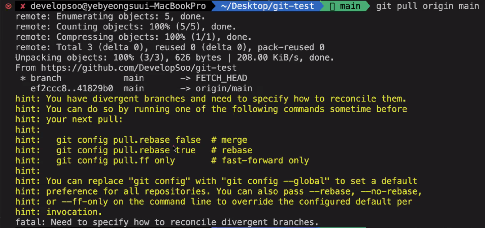

## Git, GitHub
- Git: 변경 내용을 추적하고 관리하는 분산 버전 관리(형상 관리) 시스템
- GitHub: Git을 기반으로 하는 웹 호스팅 서비스

### Git Workflow
  

### Git 명령어
- init: 새로운 Git Repository를 생성
- status: Local Repository의 상황을 확인
- add: Working Directory 내의 변경 내용을 Staging Area에 추가 (기록할 변경 내용을 추가)
- commit: Staging Area에 올라온 변경 내용을 Local Repository에 기록 (추가된 변경 내용을 실제로 기록)
- log: Commit Log를 확인
- reset: 과거의 Commit으로 이동
- reflog: Local Repository에서 HEAD의 업데이트 기록을 확인
- push: Local Repository의 변경 내용을 Remote Repository에 반영
- remote
  - -v: Git Remote Aliases 확인
  - add [alias] [url]: Git Remote Alias 추가
- clone [url] [dir]: Remote Repository의 내용을 로컬에 복제
- pull: Remote Repository의 변경 내용을 Local Repository에 반영

### 충돌 해결

#### git config pull.rebase false
rebase를 하지 않도록 설정하여 merge를 수행한다.

merge를 수행하다 충돌이 발생하면 수동으로 충돌 부분을 수정하고 반영한다.

#### 충돌이 발생하는 이유
같은 파일의 같은 위치에 코드가 변경되었기 때문이다.

## 미니 프로젝트 (팀 + 자기소개 웹페이지 만들기)
오늘부터 9 to 9 본 캠프가 시작되었다.
팀이 정해졌고 팀 이름, 소개를 정하고 역할 분담과 사용할 기술을 정하였으며 와이어프레임 설계까지 완료하였다.
메인/상세 페이지로 나눠지는 간단한 페이지를 개발할 예정이고, 상세 페이지 내에 들어가는 방명록 파트의 HTML을 작성하는 부분을 맡았다.
