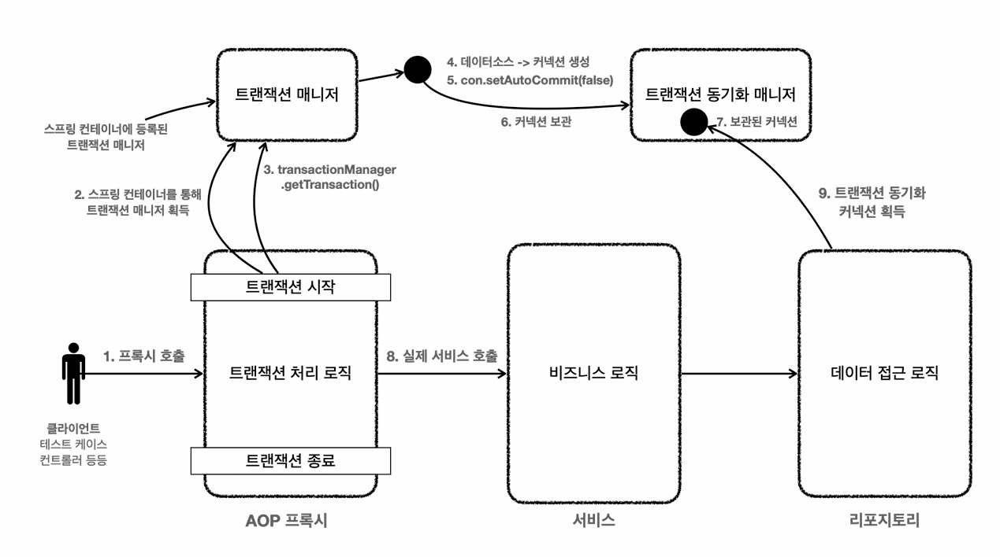
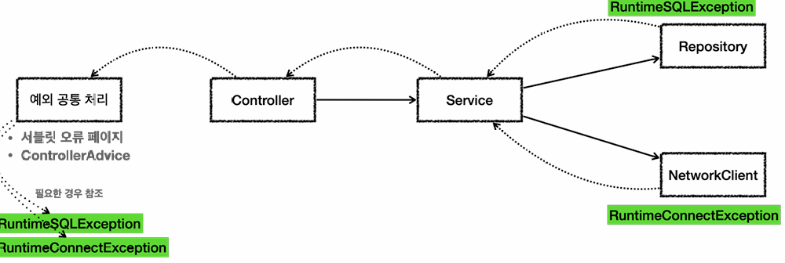
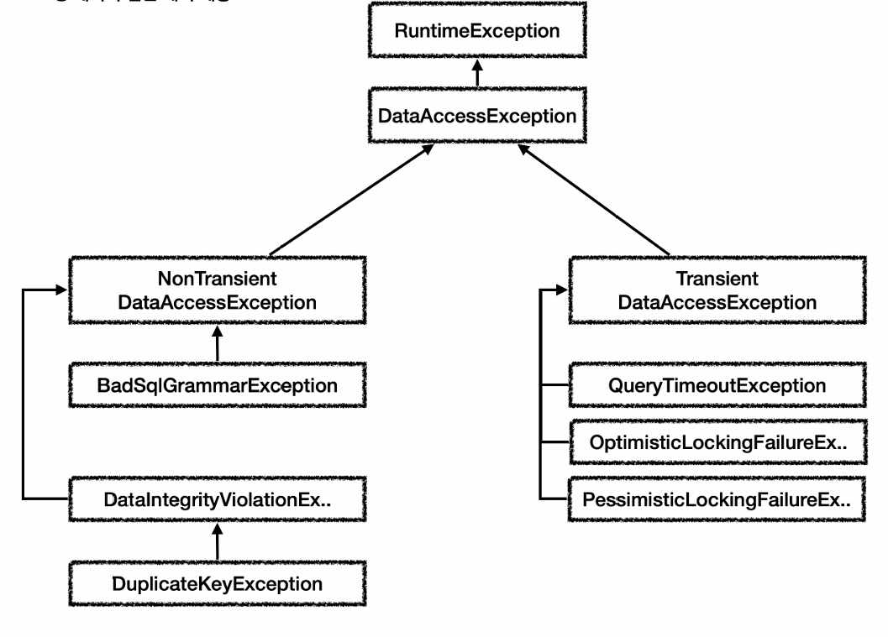

## Spring Transaction



### 선언적 트랜잭션 관리 vs 프로그래밍 방식의 트랜잭션 관리
- **선언적 트랜잭션 관리(Declarative Transaction Management)**
  - **@Transactional** 애너테이션 하나만 선언해서 편리하게 트랜잭션을 적용하는 것
- **프로그래밍 방식의 트랜잭션 관리(programmatic Transaction Management)**
  - 트랜잭션 매니저 또는 트랜잭션 탬플릿 등을 사용해서 트랜잭션 관련 코드를 직접 작성하는 것

- **선언적 트랜잭션 관리** 가 훨씬 간편하고 실용적이기 때문에 실무에서는 대부분 **선언적 트랜잭션 관리** 를 사용한다.

### Spring Boot Auto Configuration

``` java
@Bean
DataSource dataSource() {
    return new DriverManagerDataSource(URL, USERNAME, PASSWORD);
}

@Bean
PlatformTransactionManager transactionManager() {
    return new DataSourceTransactionManager(dataSource());
}
```
- 스프링 부트가 등장하기 이전에는 **DataSource** 와 **TransactionManager** 를 개발자가 직접 스프링 빈으로 등록해서 사용했다. (옛날에는 XML로 스프링 빈을 등록하고 관리했다.)
- 사용자가 등록한 빈은은 스프링 부트는 자동으로 등록하지 않는다.
- **application.yml** 또는 **application.properties** 에 있는 속성을 사용하는 경우도 있다.

#### DataSource Auto Configuration
``` yml
spring:
  datasource:
    url: jdbc:h2:tcp://localhost/~/tes
    username: sa
    password: 
```
- 스프링 부트가 기본으로 생성하는 DataSource는 커넥션 풀을 제공하는 HikariDataSource 이다.
- spring.datasource.url 속성이 없으면 **내장 데이터베이스(메모리 DB)** 를 생성하려고 시도한다.

#### Transaction Manager Auto Configuration
- 스프링 부트는 현재 등록된 라이브러리를 보고 적절한 트랜잭션 매니저를 자동으로 선택하여 스프링 빈에 등록한다.

---

## Exception

### 예외 계층


- **Error**
  - 메모리 부족이나 심각한 시스템 오류와 같이 애플리케이션이 복구 불가능한 시스템 예외이다. 개발자는 이 예외를 잡으려고 해서는 안된다.
- **Exception**
  - 애플리케이션 로직에서 사용할 수 있는 실질적인 최상위 예외이다.
  - **Exception** 과 그 하위 예외는 모두 컴파일러가 체크하는 체크 예외이다. 단 **RuntimeException** 은 예외로 한다.
- **RuntimeException**
  - 컴파일러가 체크하지 않는 언체크 예외이다.

### 예외 기본 규칙
1. 예외는 잡아서 처리하거나 던져야 한다.
2. 예외를 잡거나 던질 때 지정한 예외뿐만 아니라 그 예외의 자식들도 함께 처리된다.

#### 예외를 처리하지 못하고 계속 던지면 어떻게 될까?
- 자바 main() 쓰레드의 경우 예외 로그를 출력하면서 시스템이 종료된다.
- 웹 애플리케이션의 경우 여러 사용자의 요청을 처리하기 때문에 하나의 예외 때문에 시스템이 종료되면 안된다. WAS가 해당 예외를 받아서 처리하는데, 주로 사용자에게 개발자가 지정한 오류 페이지를 보여준다.

### 체크 예외, 언체크 예외

#### 체크 예외

- 체크 예외는 잡아서 처리하거나 밖으로 던지도록 선언해야한다. 그렇지 않으면 컴파일러 오류가 발생한다.

``` java
try {

} catch (Exception e) {

}
```
- 체크 예외를 잡아서 처리하려면 try catch 문을 사용한다.
- catch 는 해당 타입과 그 하위 타입 모두 잡을 수 있다.
- 장점: 개발자가 실수로 예외를 누락하지 않도록 컴파일러를 통해 문제를 잡아주는 안전장치이다.
- 단점: 크게 신경쓰고 싶지 않은 예외까지 모두 챙겨야 한다. 추가로 의존관계에 따른 단점도 있다.

#### 언체크 예외
- 컴파일러가 예외를 체크하지 않는다.
- 예외를 던지는 **throw 예외** 를 선언하지 않고 생략할 수 있다. 이 경우 자동으로 예외를 던진다.
- 장점: 신경쓰고 싶지 않은 언체크 예외를 무시할 수 있다. 추가로 의존관계를 참조하지 않아도 된다.
- 단점: 개발자가 실수로 예외 처리를 누락할 수 있다.

#### 체크 예외 활용
- 기본적으로 언체크(런타임) 예외를 사용하자.
- 체크 예외는 비즈니스 로직상 의도적으로 던지는 예외에만 사용하자.
  - 해당 예외를 잡아서 반드시 처리해야 하는 문제일 때만 사용해야 한다.
  - ex)
    - 계좌 이체 실패 예외
    - 결제시 포인트 부족 예외
    - 로그인 ID, PW 불일치 예외
  - 물론 이 경우에도 100% 체크 예외로 만들어야 하는 것은 아니다. 다만 매우 심각한 문제는 개발자가 실수로 예외를 놓치면 안된다. 이 경우 체크 예외로 만들어두면 컴파일러를 통해 놓친 예외를 인지할 수 있다.

#### 체크 예외의 문제점


- Repository는 DB에 접근해서 데이터를 저장하고 관리한다. 여기서는 **SQLException** 체크 예외를 던진다.
- NetworkClient는 외부 네트워크에 접속해서 어떤 기능을 처리하는 객체이다. 여기서는 **ConnectException** 체크 예외를 던진다.
- Service는 Repository와 NetworkClient 둘 다 호출한다.
- Service는 **SQLException** 과 **ConnectException** 을 처리할 수 없으므로 둘 다 밖으로 던진다.
  - ConnectException 처럼 연결이 실패하거나 SQLException 처럼 데이터베이스에서 발생하는 문제처럼 심각한 문제들은 대부분 애플리케이션 로직에서 처리할 방법이 없다. 
- Controller도 두 예외를 처리할 방법이 없어서 밖으로 던진다.
- 웹 애플리케이션이라면 Servlet의 오류 페이지나 스프링 MVC가 제공하는 ControllerAdvice에서 이런 예외를 공통 처리한다.
  - 이런 문제들은 보통 사용자에게 어떤 문제가 발생했는지 자세히 설명하기 어렵기 때문에 일반적인 오류 메시지를 보여준다. (자세히 알려주어도 사용자는 알 수 없고 보안에 문제가 될 수 있다.)
  - API라면 보통 Internal Server Error 를 사용해서 응답을 내려준다.
  - 이렇게 해결이 불가능한 공통 예외는 별도의 오류 로그를 남기고 개발자가 오류를 빨리 인지할 수 있도록 메일, 알림 등을 통해서 전달 받아야한다. SQLException 이 잘됫된 SQL을 작성해서 발생했다면 수정해서 배포하기 전까지 같은 문제가 계속 있다.

##### 복구 불가능한 예외
심각한 문제들은 대부분 복구가 불가능하다. 특히나 대부분의 Service나 Controller에서는 이런 문제를 해결할 수 없다. 
따라서 이런 문제들은 일관성 있게 공통으로 처리해야 한다. 오류 로그를 남기고 개발자가 해당 오류를 빠르게 인지하는 것이 필요하다.
Servlet Filter, Spring Intercepter, Spring ControllerAdvice를 사용하면 이런 부분을 깔끔하게 공통으로 해결할 수 있다.

##### 의존 관계에 대한 문제
대부분의 예외는 복구 불가능한 예외이다. 그런데 체크 예외이기 때문에 Controller나 Service 입장에서는 처리할 수 없어도 어쩔 수 없이 **throws 예외** 를 통해 던지는 예외를 선언해야한다.

```java
 class Controller {
    public void request() throws SQLException, ConnectException {
        service.logic();
    }
 }
 class Service {
    public void logic() throws SQLException, ConnectException {
        repository.call();
        networkClient.call();
    }
 }
```

Service, Controller 에서 SQLException 을 의존하기 때문에 문제가 된다.

향후 Repository를 JDBC 기술이 아닌 다른 기술로 변경한다면 SQLException 에 의존하던 모든 Service, Controller의 코드를 수정해야한다. Service나 Controller 입장에서는 어차피 본인이 처리할 수도 없는 예외를 읜존해야 하는 큰 단점이 발생한다.
결과적으로 OCP, DI를 통해 클라이언트 코드의 변경없이 대상 구현체를 변경할 수 있다는 장점이 체크 예외 때문에 발목을 잡게 된다.

```java
void method() throws Exception {...}
```
이를 해결하려면 최상위 예외인 Exception을 던져도 문제를 해결할 수 있다. 
하지만 다른 체크 예외를 체크할 수 있는 기능이 무효화되고, 중요한 체크 예외를 다 놓치게된다. 
이렇게 하면 모든 예외를 다 던지기 때문에 체크 예외를 의도한대로 사용하는 것이 아니다. 
따라서 꼭 필요한 경우가 아니면 쓰지 않는 것이 좋다.

#### 언체크 예외 활용



시스템에서 발생한 예외는 대부분 복구 불가능 예외이다. 
런타임 예외를 사용하면 Service나 Controller가 이런 복구 불가능한 예외를 신경쓰지 않아도 된다. 
물론 이렇게 복구 불가능한 예외는 일관성있게 공통으로 처리해야한다.

런타임 예외는 해당 객체가 처리할 수 없는 예외는 무시하면 된다. 따라서 체크 예외처럼 강제로 의존하지 않아도 된다.

런타임 예외는 문서화를 잘해야 한다. 또는 코드에 **throws 런타임 예외** 를 남겨서 중요한 예외를 인지할 수 있게 해준다.

``` java
/**
 * Make an instance managed and persistent.
 * @param entity  entity instance
 * @throws EntityExistsException if the entity already exists.
 * @throws IllegalArgumentException if the instance is not an
 *         entity
 * @throws TransactionRequiredException if there is no transaction when
 *         invoked on a container-managed entity manager of that is of type 
 *         <code>PersistenceContextType.TRANSACTION</code>
 */
 public void persist(Object entity);
 ```

 ```java
  /**
 * Issue a single SQL execute, typically a DDL statement.
 * @param sql static SQL to execute
 * @throws DataAccessException if there is any problem
 */
 void execute(String sql) throws DataAccessException
 ```

### 예외 포함과 StackTrace

예외를 전환할 때는 꼭 기존 예외를 포함해야 한다. 그렇지 않으면 StackTrace를 확인할 때 심각한 문제가 발생한다.

```java
void printEx() {
    Controller controller = new Controller();
    try {
        controller.request();
    } 
    catch (Exception e) {
        //e.printStackTrace(); // 실무에서 사용 X
        log.info("ex", e); // 로그에 StackTrace를 출력할 수 있다.
    }
}
```

```java
public void call() {
    try {
        runSQL();
    } catch (SQLException e) {
        throw new RuntimeSQLException(e); // 기존 예외(e) 포함
    }
}
```

예외를 포함하지 않으면 기존에 발생한 예외와 StackTrace를 확인할 수 없어 원인을 알 수 없는 심각한 문제가 발생한다.

### Spring 예외 추상화



- Spring은 데이터 접근 계층에 대한 수십 가지 예외를 정리해서 일관된 예외 계층을 제공한다.
- 각각의 예외는 특정 기술에 종속적이지 않게 설계되어있다. 따라서 Service 계층에서도 사용 가능하다.
- 기술에 종속적인 예외를 Spring이 제공하는 예외로 변환해주는 역할도 Spring이 제공한다.
- 크게 **NonTransient** 예외와 **Transient** 예외이다.
  - **Transient** 예외들은 일시적으로 발생한 예외로 다시 시도했을 때 성공할 가능성이 있다.
  - **NonTransient** 예외들은 일시적이지 않다는 뜻으로 다시 시도해도 실패한다.

#### 예외 변환기

``` java
@Test
void exceptionTranslator() {
    String sql = "select bad grammar";
    try {
        Connection con = dataSource.getConnection();
        PreparedStatement stmt = con.prepareStatement(sql);
        stmt.executeQuery();
    } catch (SQLException e) {
        assertThat(e.getErrorCode()).isEqualTo(42122);

        //org.springframework.jdbc.support.sql-error-codes.xml
        SQLExceptionTranslator exTranslator = new SQLErrorCodeSQLExceptionTranslator(dataSource);

        //org.springframework.jdbc.BadSqlGrammarException
        DataAccessException resultEx = exTranslator.translate("select", sql, e);
        log.info("resultEx", resultEx);
        assertThat(resultEx.getClass()).isEqualTo(BadSqlGrammarException.class);
    }
}
```

- Spring은 데이터베이스에서 발생한 오류 코드를 Spring이 정의한 예외로 자동으로 변환해주는 변환기를 제공한다.
- 변환할 때 아래의 **org.springframework.jdbc.support.sql-error-codes.xml** 파일을 이용한다.

``` xml
<bean id="H2" class="org.springframework.jdbc.support.SQLErrorCodes">
    <property name="badSqlGrammarCodes">
        <value>42000,42001,42101,42102,42111,42112,42121,42122,42132</value>
    </property>
    <property name="duplicateKeyCodes">
        <value>23001,23505</value>
    </property>
</bean>
<bean id="MySQL" class="org.springframework.jdbc.support.SQLErrorCodes">
    <property name="badSqlGrammarCodes">
        <value>1054,1064,1146</value>
    </property>
    <property name="duplicateKeyCodes">
        <value>1062</value>
    </property>
</bean>
```

- Spring 예외 추상화 덕분에 특정 기술에 종속적이지 않게 되었다.
- 물론 Spring이 제공하는 예외를 사용하기 때문에 Spring에 대한 기술 종속성을 발생한다.
  - Spring에 대한 기술 종속성까지 완전히 제거하려면 예외를 모두 직접 정의하고 예외 변환도 직접 하면 되지만, 실용적인 방법은 아니다.
