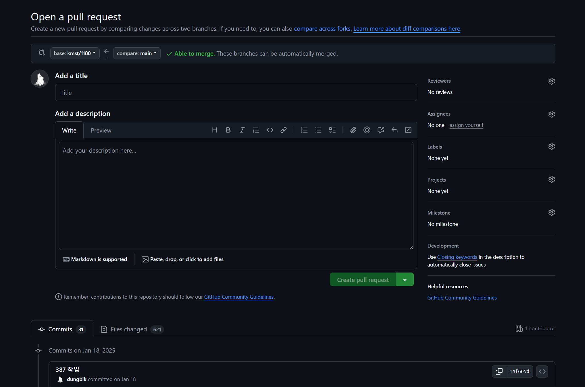

## 코드카타

### LinkedList 끝에서 K번째 값 출력하기

LinkedList에서 Node가 Next Node만 알고 있다고 했을 때, 끝에서 K 번째 노드를 바로 찾을 수 없다.
따라서 LinkedList의 크기를 구하고, 그 크기에서 K a만큼 뺀 순서의 노드를 반환하도록 하였다.

``` python
class Node:
    def __init__(self, data):
        self.data = data
        self.next = None


class LinkedList:
    def __init__(self, value):
        self.head = Node(value)

    def append(self, value):
        cur = self.head
        while cur.next is not None:
            cur = cur.next
        cur.next = Node(value)

    def get_kth_node_from_last(self, k):
        last_node = self.head
        size = 1
        while last_node.next is not None:
            last_node = last_node.next
            size += 1

        target_index = size - k
        result_node = self.head
        for i in range(target_index):
            result_node = result_node.next

        return result_node


linked_list = LinkedList(6)
linked_list.append(7)
linked_list.append(8)

print(linked_list.get_kth_node_from_last(2).data)
```

### 배달의 민족 배달 가능 여부

> Q. 배달의 민족 서버 개발자로 입사했다.
> 상점에서 현재 가능한 메뉴가 ["떡볶이", "만두", "오뎅", "사이다", "콜라"] 일 때, 유저가 ["오뎅", "콜라", "만두"] 를 주문했다.
> 
> 그렇다면, 현재 주문 가능한 상태인지 여부를 반환하시오.

단순하게 유저가 주문한 메뉴 문자열들이 가능한 메뉴에 포함되어 있는지만 확인하면 된다. 따라서 **in 연산자** 을 이용하면 된다.

```python
shop_menus = ["만두", "떡볶이", "오뎅", "사이다", "콜라"]
shop_orders = ["오뎅", "콜라", "만두"]

def is_available_to_order(menus, orders):
    menus_set = set(menus)
    for order in orders:
        if order not in menus_set:
            return False
    return True

result = is_available_to_order(shop_menus, shop_orders)
print(result)
```

**list 자료형** 로 메뉴 목록을 받아왔는데 **set 자료형** 으로 바꾸었다. 그 이유는 파이썬은 내부에서 list에서 **in 연산자** 수행 시 O(N) 으로 동작하지만, **set** 은 O(1) 로 동작하기 때문이다.

### 더하거나 빼거나

> Q. 음이 아닌 정수들로 이루어진 배열이 있다. 이 수를 적절히 더하거나 빼서 특정한 숫자를 만들려고 한다. 예를 들어 [1, 1, 1, 1, 1]로 숫자 3을 만들기 위해서는 다음 다섯 방법을 쓸 수 있다.
> 
> -1+1+1+1+1 = 3  
> +1-1+1+1+1 = 3  
> +1+1-1+1+1 = 3  
> +1+1+1-1+1 = 3  
> +1+1+1+1-1 = 3  
> 
> 사용할 수 있는 숫자가 담긴 배열 numbers, 타겟 넘버 target_number이 매개변수로 주어질 때 숫자를 적절히 더하고 빼서 타겟 넘버를 만드는 방법의 수를 반환하시오.

좋은 방법이 있나 생각을 해봤는데, 따로 떠오르는 방법이 없어서 브루트포스로 풀었다.  
더하거나 뺄 숫자가 하나 늘어날 때마다 기존의 경우들에서 + 혹은 - 를 하는 경우를 추가해주면 재귀적으로 구할 수 있다.  

예를 들어 아래와 같은 경우들이 있다고 가정을 하자.  
- 1 +1 
- -1 +1  
- 1 -1  
- -1 -1  

각 경우들에 새로 추가된 1을 더하거나 빼는 경우를 더하면 1이 3개 일 때 더하거나 빼는 모든 경우를 구할 수 있다.  
- 1 +1 
  - 1 +1 +1
  - 1 +1 -1
- -1 +1  
  - -1 +1 +1
  - -1 +1 -1
- 1 -1  
  - 1 -1 +1
  - 1 -1 -1
- -1 -1  
  - -1 -1 +1
  - -1 -1 -1

```python
numbers = [1, 1, 1, 1, 1]
target_number = 3

def get_count_of_ways_to_target_by_doing_plus_or_minus(array, target):
    all_ways = []

    def recur(array, current_index, current_sum):
        if current_index == len(array):
            all_ways.append(current_sum)
            return

        recur(array, current_index + 1, current_sum + array[current_index])
        recur(array, current_index + 1, current_sum - array[current_index])

    recur(array, 0, 0)
    target_count = 0

    for way in all_ways:
        if target == way:
            target_count += 1

    return target_count

result = get_count_of_ways_to_target_by_doing_plus_or_minus(numbers, target_number)
print(result)
```

---

## Git 협업

### Branch

- branch: 브랜치 확인
  - 브랜치이름: 브랜치 생성
  - -m 브랜치이름: 브랜치 이름 변경
  - -d 브랜치이름: 브랜치 삭제
- switch 브랜치이름: 브랜치 이동 (new)
  - -c 브랜치이름: 브랜치 생성 & 이동
- checkout 브랜치이름: 브랜치 이동 (old)
  - -b 브랜치이름: 브랜치 생성 & 이동
- merge 브랜치이름: 브랜치 병합

### Pull Request

  

  

- 코드 리뷰를 위해 사용한다. 
- Confirm이 되면 자동으로 Merge 된다.

### 협업 실전 가이드

- main / develop / feature branch를 사용하기
- Pull Request를 통해 코드 리뷰 후 feature branch에서 develop branch로 병합하기
- Pull Request에서 Reviewers랑 Assignees 지정하기
- 충돌시 로컬에서 해결 후 테스트하고 병합한다.
