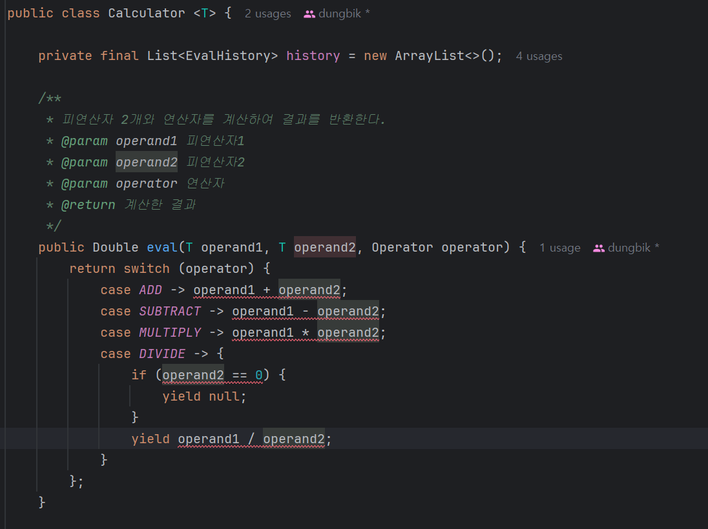
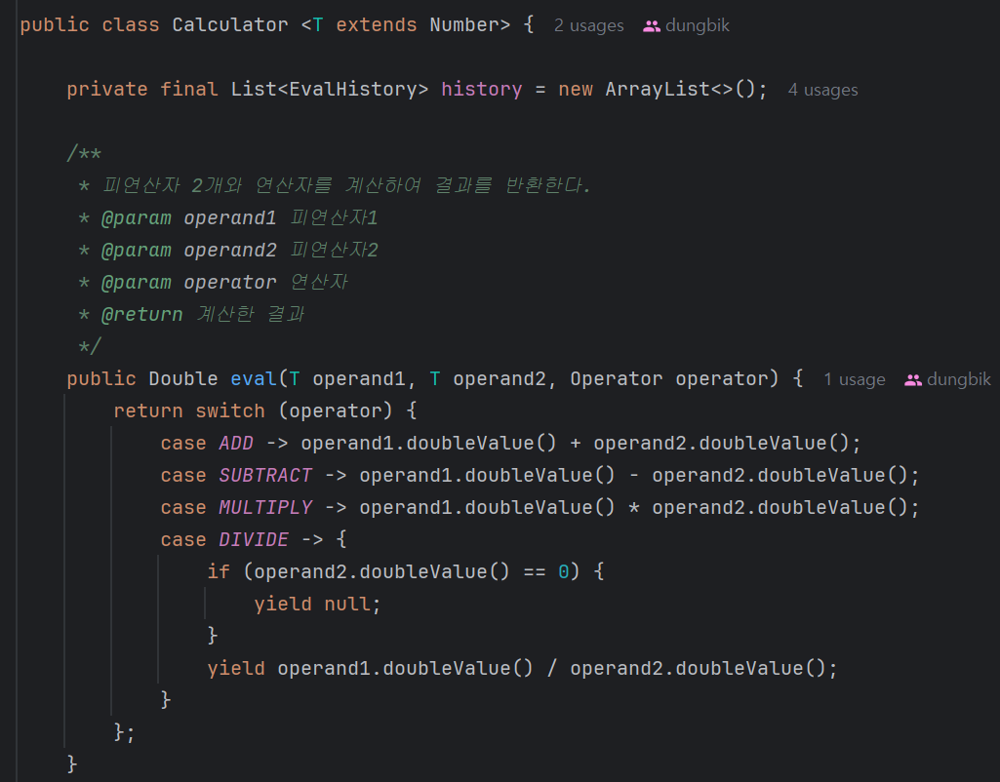

## ch.2 계산기 과제 트러블 슈팅

### 개요
정수만 받아서 계산하던 계산기를 실수도 받을 수 있게 계산하는데 단순히 int/long 에서 float/double로 바꾸는 것이 아닌 제네릭을 이용하여 리팩토링을 하는 과정에서 생겼던 문제를 다뤄보겠습니다.

### 트러블 슈팅
#### 배경

``` java
public class Calculator {

    /**
     * 피연산자 2개와 연산자를 계산하여 결과를 반환한다.
     * @param operand1 피연산자1
     * @param operand2 피연산자2
     * @param operation 연산자
     * @return 계산한 결과
     */
    public Integer eval(int operand1, int operand2, char operation) {
        return switch (operation) {
            case '+' -> operand1 + operand2;
            case '-' -> operand1 - operand2;
            case '*' -> operand1 * operand2;
            case '/' -> {
                if (operand2 == 0) {
                    yield null;
                }
                yield operand1 / operand2;
            }
            default -> throw new RuntimeException("Unexpected operation: " + operation);
        };
    }

    ...
}
```

#### 발단



정수만 받아서 계산하던 코드를 단순하게 제네릭으로 바꾸면 숫자를 연산할 수 없는 문제가 생깁니다.  

#### 전개

해당 오류는 사칙연산은 숫자의 경우에만 연산이 가능한데 제네릭의 경우 숫자가 아닌 다른 형태를 가질 수 있기 때문에 발생합니다.
따라서 제네릭 T 가 항상 숫자임을 알려주고 연산을 하면 해결이 될 것 같아서 T에 타입을 나타낼 수 있는 방법이 있는지 찾아보고 적용해보았습니다.  
그 결과 아래의 코드로 해결을 하였습니다.



#### 결말

사칙연산은 숫자에만 연산이 가능하단 점을 생각하여, 제네릭에 숫자라는 것을 알려주면 해결될지 않을까? 라는 생각으로 해결을 하였습니다.

### 마무리

이번 트러블 슈팅을 요약하면 다음과 같습니다.
1. 제네릭에 사칙연산과 같이 특정 타입에만 사용할 수 있는 것을 쓸 수 없습니다.
2. 따라서 제네릭은 항상 숫자라는 것을 알려주면 해결이 될 것 같아 찾아보고 적용하였습니다.
3. 적용한 내용이 정상적으로 동작이 되었습니다.
