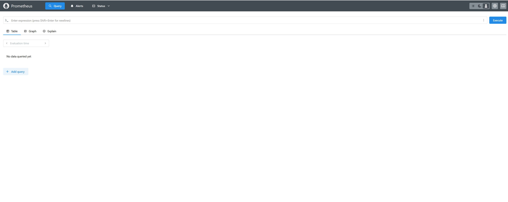
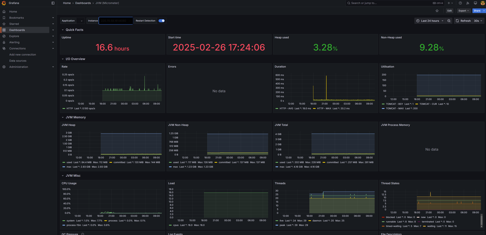

## 코드카타

### 최대로 할인 적용하기

> Q. 다음과 같이 숫자로 이루어진 배열이 두 개가 있다. 
> 하나는 상품의 가격을 담은 배열이고, 하나는 쿠폰을 담은 배열이다.
> 쿠폰의 할인율에 따라 상품의 가격을 할인 받을 수 있다.
> 이 때, 최대한 할인을 많이 받는다면 얼마를 내야 하는가?
> 단, 할인쿠폰은 한 제품에 한 번씩만 적용 가능하다.

> [30000, 2000, 1500000] # 상품의 가격  
> [20, 40] # 쿠폰, 할인율의 단위는 % 입니다.

가장 할인을 많이 받기 위해선 상품의 가격이 비싼 순으로 할인율이 높은 쿠폰을 적용하면 된다.  
그리고 상품의 수와 쿠폰의 가격이 같지 않기 때문에 할인을 적용할 때는 상품의 수 혹은 쿠폰 수 하나를 지정해놓고 반복을 하면 안되고 둘 중에 작은 숫자만큼 반복을 수행해야한다.

``` python
def get_max_discounted_price(prices, coupons):
    coupons.sort(reverse=True)
    prices.sort(reverse=True)
    price_index = 0
    coupon_index = 0
    max_discounted_price = 0

    while price_index < len(prices) and coupon_index < len(coupons):
        max_discounted_price += prices[price_index] * (100 - coupons[coupon_index]) / 100
        price_index += 1
        coupon_index += 1

    while price_index < len(prices):
        max_discounted_price += prices[price_index]
        price_index += 1

    return int(max_discounted_price)

print("정답 = 926000 / 현재 풀이 값 = ", get_max_discounted_price([30000, 2000, 1500000], [20, 40]))
print("정답 = 485000 / 현재 풀이 값 = ", get_max_discounted_price([50000, 1500000], [10, 70, 30, 20]))
print("정답 = 1550000 / 현재 풀이 값 = ", get_max_discounted_price([50000, 1500000], []))
print("정답 = 1458000 / 현재 풀이 값 = ", get_max_discounted_price([20000, 100000, 1500000], [10, 10, 10]))
```

### 올바른 괄호

> Q. 괄호가 바르게 짝지어졌다는 것은 '(' 문자로 열렸으면 반드시 짝지어서 ')' 문자로 닫혀야 한다는 뜻이다. 예를 들어
> 
> ()() 또는 (())() 는 올바르다.
> )()( 또는 (()( 는 올바르지 않다.
> 
> 이 때, '(' 또는 ')' 로만 이루어진 문자열 s가 주어졌을 때, 문자열 s가 올바른 괄호이면 True 를 반환하고 아니라면 False 를 반환하시오.

괄호가 바르게 짝지어졌는지 확인을 하기 위해서는 닫는 괄호가 나왔을 때, 직전에 나왔던 괄호가 열려있는지 확인해야한다.  
즉, 배열로 생각했을 때 열린 괄호가 나오면 모두 저장하고 닫힌 괄호가 나왔을 때 가장 최근에 있던 열린 괄호를 삭제 하는 것을 반복하여 마지막에 배열이 비어있는지 여부를 확인하면 된다.

``` python
def is_correct_parenthesis(string):
    stack = []

    for i in range(len(string)):
        if string[i] == "(":
            stack.append(string[i])
        elif string[i] == ")":
            if len(stack) == 0:
                return False
            stack.pop()

    if len(stack) != 0:
        return False
    else:
        return True


print("정답 = True / 현재 풀이 값 = ", is_correct_parenthesis("(())"))
print("정답 = False / 현재 풀이 값 = ", is_correct_parenthesis(")"))
print("정답 = False / 현재 풀이 값 = ", is_correct_parenthesis("((())))"))
print("정답 = False / 현재 풀이 값 = ", is_correct_parenthesis("())()"))
print("정답 = False / 현재 풀이 값 = ", is_correct_parenthesis("((())"))
```

### 멜론 베스트 앨범 뽑기

> Q. 멜론에서 장르 별로 가장 많이 재생된 노래를 두 개씩 모아 베스트 앨범을 출시하려 한다.
> 
> 노래는 인덱스로 구분하며, 노래를 수록하는 기준은 다음과 같다.
> 
> 1. 속한 노래가 많이 재생된 장르를 먼저 수록한다. (단, 각 장르에 속한 노래의 재생 수 총합은 모두 다르다.)
> 
> 2. 장르 내에서 많이 재생된 노래를 먼저 수록한다.
> 
> 3. 장르 내에서 재생 횟수가 같은 노래 중에서는 고유 번호가 낮은 노래를 먼저 수록한다.
> 
> 노래의 장르를 나타내는 문자열 배열 genres와 노래별 재생 횟수를 나타내는 정수 배열 plays가 주어질 때, 베스트 앨범에 들어갈 노래의 인덱스를 순서대로 반환하시오.

각 장르에 속한 노래의 재생 수를 더하여 정렬을 하면 1번의 결과를 알 수 있다. 이를 쉽게 하기 위해선 딕셔너리를 활용해 key를 장르 value를 재생 수의 합으로 하면 된다.  

그리고 2번의 결과를 알기 위해 딕셔너리를 활용해 key를 장르 value를 노래 고유 번호와 재생 수를 배열의 형태로 배열에 담는다.  
그 후 value에 들어 있는 배열에서 재생 수를 기준으로 정렬을 하면 된다.  
여기서 고유 번호가 낮은 노래의 처리를 하지 않은 이유는 **정렬을 할 때 기준이 같다면 순서가 변하지 않기** 떄문이다.  

마지막 3번의 결과는 지금까지 구한 결과를 토대로 알 수 있다.


``` python
from collections import defaultdict

def get_total_play(songs):
    return sum([x[1] for x in songs])

def get_melon_best_album(genre_array, play_array):
    music_dict = defaultdict(list)

    song_id = 0
    for genre, play in zip(genres, plays):
        music_dict[genre].append((song_id, play))
        song_id += 1

    sorted_music_dict = sorted(music_dict.items(), key=lambda x: get_total_play(x[1]), reverse=True)

    answer = []
    for _, songs in sorted_music_dict:
        sorted_songs = sorted(songs, key=lambda x: x[1], reverse=True)
        answer.extend([x[0] for x in sorted_songs[0: min(len(songs), 2)]])

    return answer

print("정답 = [4, 1, 3, 0] / 현재 풀이 값 = ", get_melon_best_album(["classic", "pop", "classic", "classic", "pop"], [500, 600, 150, 800, 2500]))
print("정답 = [0, 6, 5, 2, 4, 1] / 현재 풀이 값 = ", get_melon_best_album(["hiphop", "classic", "pop", "classic", "classic", "pop", "hiphop"], [2000, 500, 600, 150, 800, 2500, 2000]))
```

## 모니터링

### 모니터링 3단계
- 대시보드
  - 전체를 한눈에 볼 수 있는 가장 높은 뷰
  - 마이크로미터, 프로메테우스, 그라파나 등
  - 모니터링 대상
    - 시스템 메트릭
    - 애플리케이션 메트릭
    - 비즈니스 메트릭
- 애플리케이션 추적
  - 주로 각각의 HTTP 요청을 추적, 일부는 마이크로서비스 환경에서 분산 추적
  - 핀포인트, 스카우트, 와탭, 제니퍼 등
- 로그
  - 가장 자세한 추적 가능, 원하는대로 커스텀 가능
  - 같은 HTTP 요청을 묶어서 확인할 수 있는 방법 중요 (MDC 적용)

각각 용도가 다르고, 관찰을 할 때는 전체에서 점점 좁게 보는 것이 좋다.

모니터링 툴에서 일정 이상 수치가 넘어가면 슬랙 혹은 문자 등으로 알람을 주는 것이 좋으며, 이 때의 알람은 경고/심각 수준으로 구분해서 관리하는 것이 좋다.

### 프로메테우스, 그라파나

모니터링 대시보드를 구축하기 위해서 프로메테우스와 그라파나를 설치하였다.

``` yml
networks:
  common:
    driver: bridge
    
  prometheus:
    image: prom/prometheus
    container_name: prometheus
    volumes:
      - ./prometheus/config:/etc/prometheus
      - prometheus-data:/prometheus
    ports:
      - 9090:9090
    command:
      - '--storage.tsdb.path=/prometheus'
      - '--config.file=/etc/prometheus/prometheus.yml'
    restart: always
    networks:
      - common

  grafana:
    image: grafana/grafana
    container_name: grafana
    ports:
      - 3000:3000
    volumes:
      - grafana-data:/var/lib/grafana
      - ./grafana/provisioning/:/etc/grafana/provisioning/
    restart: always
    depends_on:
      - prometheus
    networks:
      - common

volumes:
  grafana-data:
  prometheus-data:
```

직접 관리하고 있는 Ubuntu 24.04 서버에 설치를 하였으며, 도커 컴포즈를 이용해 설치를 하였다.  

``` yml
# my global config
global:
  scrape_interval: 15s # Set the scrape interval to every 15 seconds. Default is every 1 minute.
  evaluation_interval: 15s # Evaluate rules every 15 seconds. The default is every 1 minute.
  # scrape_timeout is set to the global default (10s).

# Alertmanager configuration
alerting:
  alertmanagers:
    - static_configs:
        - targets:
          # - alertmanager:9093

# Load rules once and periodically evaluate them according to the global 'evaluation_interval'.
rule_files:
  # - "first_rules.yml"
  # - "second_rules.yml"

# A scrape configuration containing exactly one endpoint to scrape:
# Here it's Prometheus itself.
scrape_configs:
  # The job name is added as a label `job=<job_name>` to any timeseries scraped from this config.
  - job_name: "prometheus"

    # metrics_path defaults to '/metrics'
    # scheme defaults to 'http'.

    static_configs:
      - targets: ["localhost:9090"]

  - job_name: "mws-actuator"
    metrics_path: '/actuator/prometheus'
    scrape_interval: 10s
    static_configs:
      - targets: ['ip:8080']
```

프로메테우스가 메트릭을 수집하여 저장을 해두고, 그라파나가 프로메테우스에 저장된 데이터를 가져와 보기 좋게 대시보드를 그려준다.  
여기서 메트릭을 수집하는 대상은 스프링 부트로 개발된 웹 애플리케이션이며, 스프링 엑추에이터와 마이크로미터를 사용하여 프로메테우스와 연동을 시켜주었다.

``` sh
sudo ufw allow 9090/tcp
sudo ufw allow 3000/tcp
```

그리고 외부에서 접속할 수 있도록 방화벽에서 해당 포트를 풀어주었다.





정상적으로 동작하는 것을 확인하였다. 다음에 여유가 될 때, 애플리케이션 추적과 클라우드에서 관리하는 로그 쪽을 다뤄볼 예정이다.
