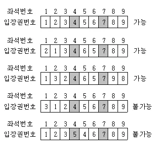

## 코드카타

### 라면 공장

> Q. 라면 공장에서는 하루에 밀가루를 1톤씩 사용합니다. 원래 밀가루를 공급받던 공장의 고장으로 앞으로 k일 이후에야 밀가루를 공급받을 수 있기 때문에 해외 공장에서 밀가루를 수입해야 합니다.
> 
> 해외 공장에서는 향후 밀가루를 공급할 수 있는 날짜와 수량을 알려주었고, 라면 공장에서는 운송비를 줄이기 위해 최소한의 횟수로 밀가루를 공급받고 싶습니다.
> 
> 현재 공장에 남아있는 밀가루 수량 stock, 밀가루 공급 일정(dates)과 해당 시점에 공급 가능한 밀가루 수량(supplies), 원래 공장으로부터 공급받을 수 있는 시점 k가 주어질 때, 밀가루가 떨어지지 않고 공장을 운영하기 위해서 최소한 몇 번 해외 공장으로부터 밀가루를 공급받아야 하는지를 반환 하시오.
> 
> dates[i]에는 i번째 공급 가능일이 들어있으며, supplies[i]에는 dates[i] 날짜에 공급 가능한 밀가루 수량이 들어 있습니다.
> 
> stock = 4  
> dates = [4, 10, 15]  
> supplies = [20, 5, 10]  
> k = 30  
> 
> 다음과 같이 입력값이 들어온다면,  
> 현재 재고가 4개 있습니다. 그리고 정상적으로 돌아오는 날은 30일까지입니다.  
> 즉, 26개의 공급량을 사와야 합니다!  
> 그러면 제일 최소한으로 26개를 가져오려면? supplies 에서 20, 10 을 가져오면 되겠죠?  
> 그래서 이 경우의 최소 공급 횟수는 2 입니다!

최소로 공급을 받기 위해서는 제일 높은 공급량을 더해서 정상적으로 돌아오는 날까지 버틸 수 있으면 된다. 여기서 현재 재고가 바닥나기 전까지 공급을 받아야한다는 것을 빼먹으면 안된다.  
재고가 바닥나기 전에 받을 수 있는 최대 공급량을 찾을 때 정렬 혹은 Max Heap 등 방법이 여러가지 있는데 여기서는 Max Heap을 사용하였다. heapq 는 Min Heap 이기 때문에 넣는 값에 -를 붙여 Max Heap 으로 사용하였다.

``` python
import heapq

def get_minimum_count_of_overseas_supply(stock, dates, supplies, k):
    answer = 0
    last_added_date_index = 0
    max_heap = []

    while stock <= k:
        while last_added_date_index < len(dates) and dates[last_added_date_index] <= stock:
            heapq.heappush(max_heap, -supplies[last_added_date_index])
            last_added_date_index += 1

        answer += 1
        heappop = heapq.heappop(max_heap)
        stock += -heappop

    return answer

print("정답 = 2 / 현재 풀이 값 = ", get_minimum_count_of_overseas_supply(4, [4, 10, 15], [20, 5, 10], 30))
print("정답 = 4 / 현재 풀이 값 = ", get_minimum_count_of_overseas_supply(4, [4, 10, 15, 20], [20, 5, 10, 5], 40))
print("정답 = 1 / 현재 풀이 값 = ", get_minimum_count_of_overseas_supply(2, [1, 10], [10, 100], 11))
```

### 로봇 청소기

> 문제 설명
> 로봇 청소기가 주어졌을 때, 청소하는 영역의 개수를 구하는 프로그램을 작성하시오.
> 
> 로봇 청소기가 있는 장소는 N×M 크기의 직사각형으로 나타낼 수 있으며, 1×1크기의 정사각형 칸으로 나누어져 있다. 
> 각각의 칸은 벽 또는 빈 칸이다. 청소기는 바라보는 방향이 있으며, 이 방향은 동, 서, 남, 북중 하나이다. 
> 지도의 각 칸은 (r, c)로 나타낼 수 있고, r은 북쪽으로부터 떨어진 칸의 개수, c는 서쪽으로 부터 떨어진 칸의 개수이다.
> 
> 로봇 청소기는 다음과 같이 작동한다.  
> 
> 1. 현재 위치를 청소한다.  
> 2. 현재 위치에서 현재 방향을 기준으로 왼쪽방향부터 차례대로 탐색을 진행한다.  
>     a. 왼쪽 방향에 아직 청소하지 않은 공간이 존재한다면, 그 방향으로 회전한 다음 한 칸을 전진하고 1번부터 진행한다.  
>     b. 왼쪽 방향에 청소할 공간이 없다면, 그 방향으로 회전하고 2번으로 돌아간다.  
>     c. 네 방향 모두 청소가 이미 되어있거나 벽인 경우에는, 바라보는 방향을 유지한 채로 한 칸 후진을 하고 2번으로 돌아간다.  
>     d. 네 방향 모두 청소가 이미 되어있거나 벽이면서, 뒤쪽 방향이 벽이라 후진도 할 수 없는 경우에는 작동을 멈춘다. 로봇 청소기는 이미 청소되어있는 칸을 또 청소하지 않으며, 벽을 통과할 수 없다.  
> 
> 입력 조건
> 로봇 청소기가 있는 칸의 좌표 (r, c)와 바라보는 방향 d가 주어진다. 이 때 d가 0인 경우에는 북쪽을, 1인 경우에는 동쪽을, 2인 경우에는 남쪽을, 3인 경우에는 서쪽을 바라보고 있는 것이다.
> 
> 또한 청소하고자 하는 방의 지도를 2차원 배열로 주어진다.
> 빈 칸은 0, 벽은 1로 주어진다. 지도의 첫 행, 마지막 행, 첫 열, 마지막 열에 있는 모든 칸은 벽이다.
> 
> 로봇 청소기가 있는 칸의 상태는 항상 빈 칸이라고 했을 때,
> 로봇 청소기가 청소하는 칸의 개수를 반환하시오.

왼쪽 방향으로 돌면서 탐색을 진행해야한다. 이를 위해서 방향부터 정의를 하였다.

||index|r|c|
|---|---|---|---|
|북|0|-1|0|
|동|1|0|1|
|남|2|1|0|
|서|3|0|-1|

이처럼 방향을 정의하면 **(index + 3) % 4** 을 왼쪽 방향이라고 할 수 있다.  
또한 후진을 해야하는데, **(index + 2) % 4**를 후진이라고 할 수 있다.

``` python
from collections import deque

def get_count_of_departments_cleaned_by_robot_vacuum(r, c, d, room_map):
    dr = [-1, 0, 1, 0]
    dc = [0, 1, 0, -1]

    n = len(room_map)
    m = len(room_map[0])
    result = 1
    room_map[r][c] = 2
    queue = deque([[r, c, d]])

    while queue:
        r, c, d = queue.popleft()
        temp_d = d

        for i in range(4):
            temp_d = (temp_d + 3) % 4
            new_r, new_c = r + dr[temp_d], c + dc[temp_d]

            if 0 <= new_r < n and 0 <= new_c < m and room_map[new_r][new_c] == 0:
                result += 1
                room_map[new_r][new_c] = 2
                queue.append([new_r, new_c, temp_d])
                break
            elif i == 3:
                new_d = (d + 2) % 4
                new_r, new_c = r + dr[new_d], c + dc[new_d]
                queue.append([new_r, new_c, d])

                if room_map[new_r][new_c] == 1:
                    return result

current_room_map2 = [
    [1, 1, 1, 1, 1, 1, 1, 1, 1, 1],
    [1, 0, 1, 1, 0, 0, 0, 0, 0, 1],
    [1, 0, 0, 0, 1, 1, 1, 1, 0, 1],
    [1, 0, 0, 1, 1, 0, 0, 0, 0, 1],
    [1, 0, 1, 1, 0, 0, 0, 0, 0, 1],
    [1, 0, 0, 0, 0, 0, 0, 0, 0, 1],
    [1, 0, 0, 0, 0, 0, 0, 1, 0, 1],
    [1, 0, 0, 0, 0, 0, 1, 1, 0, 1],
    [1, 0, 0, 0, 0, 0, 1, 1, 0, 1],
    [1, 0, 0, 0, 0, 0, 0, 0, 0, 1],
    [1, 1, 1, 1, 1, 1, 1, 1, 1, 1]
]
print("정답 = 29 / 현재 풀이 값 = ", get_count_of_departments_cleaned_by_robot_vacuum(6,3,1,current_room_map2))
current_room_map3 = [
    [1, 1, 1, 1, 1, 1, 1, 1, 1, 1],
    [1, 0, 1, 1, 0, 0, 0, 0, 0, 1],
    [1, 0, 0, 0, 1, 1, 1, 1, 0, 1],
    [1, 0, 0, 1, 1, 0, 0, 0, 0, 1],
    [1, 0, 1, 1, 0, 0, 0, 0, 0, 1],
    [1, 0, 0, 0, 0, 0, 0, 0, 0, 1],
    [1, 0, 0, 0, 0, 0, 0, 1, 0, 1],
    [1, 0, 0, 0, 0, 0, 1, 1, 0, 1],
    [1, 0, 0, 1, 0, 0, 1, 1, 0, 1],
    [1, 0, 0, 0, 0, 0, 0, 0, 0, 1],
    [1, 1, 1, 1, 1, 1, 1, 1, 1, 1]
]
print("정답 = 33 / 현재 풀이 값 = ", get_count_of_departments_cleaned_by_robot_vacuum(7,4,1,current_room_map3))
current_room_map4 = [
    [1, 1, 1, 1, 1, 1, 1, 1, 1, 1],
    [1, 0, 1, 1, 0, 0, 0, 0, 0, 1],
    [1, 0, 1, 0, 1, 1, 1, 1, 0, 1],
    [1, 0, 0, 1, 1, 0, 0, 0, 0, 1],
    [1, 0, 1, 1, 0, 0, 0, 0, 0, 1],
    [1, 0, 0, 0, 0, 0, 0, 0, 0, 1],
    [1, 0, 0, 0, 0, 0, 0, 1, 0, 1],
    [1, 0, 0, 0, 0, 0, 1, 1, 0, 1],
    [1, 0, 0, 1, 0, 0, 1, 1, 0, 1],
    [1, 0, 0, 0, 0, 0, 0, 0, 0, 1],
    [1, 1, 1, 1, 1, 1, 1, 1, 1, 1]
]
print("정답 = 25 / 현재 풀이 값 = ", get_count_of_departments_cleaned_by_robot_vacuum(6,2,0,current_room_map4))
```

### 극장 좌석

> Q. 극장의 좌석은 한 줄로 되어 있으며 왼쪽부터 차례대로 1번부터 N번까지 번호가 매겨져 있다.  
> 공연을 보러 온 사람들은 자기의 입장권에 표시되어 있는 좌석에 앉아야 한다.  
>  
> 예를 들어서, 입장권에 5번이 쓰여 있으면 5번 좌석에 앉아야 한다.  
> 단, 자기의 바로 왼쪽 좌석 또는 바로 오른쪽 좌석으로는 자리를 옮길 수 있다.  
>  
> 예를 들어서, 7번 입장권을 가진 사람은 7번 좌석은 물론이고,  
> 6번 좌석이나 8번 좌석에도 앉을 수 있다.  
> 그러나 5번 좌석이나 9번 좌석에는 앉을 수 없다.  
>  
> 그런데 이 극장에는 “VIP 회원”들이 있다.  
> 이 사람들은 반드시 자기 좌석에만 앉아야 하며 옆 좌석으로 자리를 옮길 수 없다.  
>  
> 예를 들어서,  
> 그림과 같이 좌석이 9개이고,  
> 4번 좌석과 7번 좌석이 VIP석인 경우에 <123456789>는 물론 가능한 배치이다.  
> 또한 <213465789> 와 <132465798> 도 가능한 배치이다.  
> 그러나 <312456789> 와 <123546789> 는 허용되지 않는 배치 방법이다. 
>  
> 오늘 공연은 입장권이 매진되어 1번 좌석부터 N번 좌석까지 모든 좌석이 다 팔렸다.  
> 총 좌석의 개수와 VIP 회원들의 좌석 번호들이 주어졌을 때,  
> 사람들이 좌석에 앉는 서로 다른 방법의 가짓수를 반환하시오.
> 
> seat_count = 9  
> vip_seat_array = [4, 7]  



VIP석을 제외하고 자리를 옮길 수 있고, 옮기는 것은 옆 좌석으로만 가능하다.
그러면 좌석에 앉는 서로 다른 방법의 가짓수를 구하기 위해서는 VIP 석을 제외한 좌석에서 이동 가능한 경우의 수를 구하면 된다.

이를 예시를 보며 알아내보자.

- [1] -> [1]
- [1, 2] -> [1, 2], [2, 1]
- [1, 2, 3] -> [1, 2, 3], [1, 3, 2], [2, 1, 3]
- [1, 2, 3, 4] -> [1, 2, 3, 4] [1, 2, 4, 3] [1, 3, 2, 4] [2, 1, 3, 4] [2, 1, 4, 3]
- [1, 2, 3, 4, 5] -> [1, 2, 3, 4, 5] [1, 2, 3, 5, 4] [2, 1, 3, 4, 5] [2, 1, 3, 5, 4], [1, 2, 4, 3, 5] [2, 1, 4, 3, 5] [2, 1, 3, 4, 5] [1, 3, 2, 4, 5] 

이를 보면 1, 2, 3, 5, 8 ... 피보나치 수열처럼 증가하는 것을 알 수 있다.  
따라서 피보나치 수열을 이용해 유동석의 경우의 수들을 각각 구해 모두 곱해주면 모든 경우의 수란 것을 알 수 있다.

``` python
fibo_memo = {
    0: 1,
    1: 1,
    2: 2
}

def fibo_dynamic_programming(n):
    if n in fibo_memo:
        return fibo_memo[n]

    nth_fibo = fibo_dynamic_programming(n - 1) + fibo_dynamic_programming(n - 2)
    fibo_memo[n] = nth_fibo
    return nth_fibo

def get_all_ways_of_theater_seat(total_count, fixed_seat_array):
    all_ways = 1
    current_index = 0
    for fixed_seat in fixed_seat_array:
        fixed_seat_index = fixed_seat - 1
        count_of_ways = fibo_dynamic_programming(fixed_seat_index - current_index)
        all_ways *= count_of_ways
        current_index = fixed_seat_index + 1

    count_of_ways = fibo_dynamic_programming(total_count - current_index)
    all_ways *= count_of_ways
    return all_ways

print("정답 = 4 / 현재 풀이 값 = ", get_all_ways_of_theater_seat(9,[2,4,7]))
print("정답 = 26 / 현재 풀이 값 = ", get_all_ways_of_theater_seat(11,[2,5]))
print("정답 = 6 / 현재 풀이 값 = ", get_all_ways_of_theater_seat(10,[2,6,9]))
```
