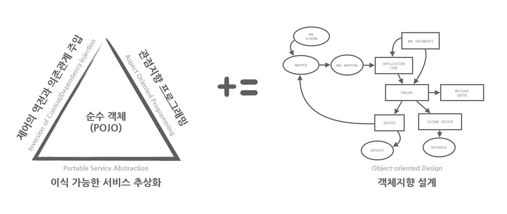
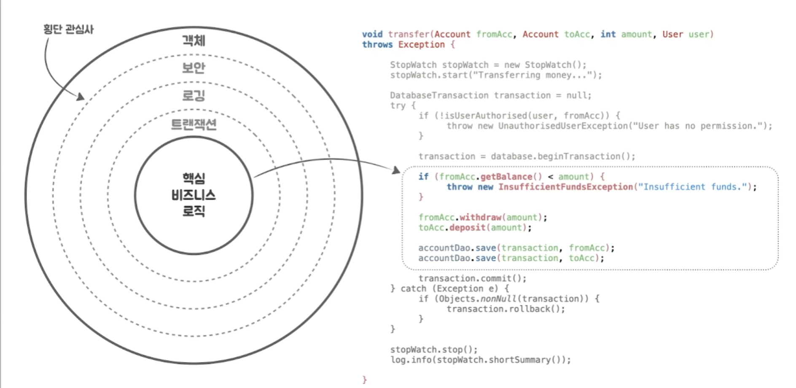
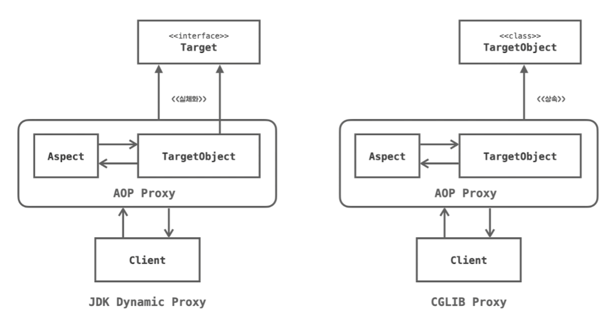
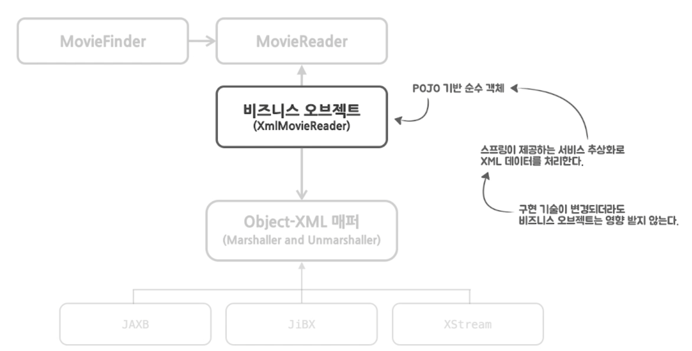

비즈니스 로직을 담은 **애플리케이션 핵심 코드**와 엔터프라이즈 기술을 처리하는 코드를 분리시킨다.

각각의 복잡함을 효과적으로 공략하기 위해 **POJO와 함께 스프링 3대 핵심 기술**을 사용한다.

이 전략이 효과적으로 적용되려면 반드시 **좋은 객체 지향 설계**가 바탕이 되어야 한다.

## Plain Old Java Object (POJO)

객체 지향적 원리에 충실하고 특정 규약과 환경에 종속되지 않게 재활용될 수 있는 방식으로 설계된 객체

```java
import javax.jms.MessageListener;
import javax.jms.Message;
import javax.jms.JMSException;

public class OrderProcesser implements MessageListener {

    @Override
    public void onMessage(Message message) {
        if (message instanceof TextMessage) {
            try {
                    OrderPlaced event = OrderPlaced.fromJson(((TextMessage) message).getText());
                    // 주문 접수 처리하기
            } catch (JMSException error) {
                    throw new RuntimeException("The message could not be read.", error);
            }
        } else {
            throw new IllegalArgumentException("Message must be of type TextMessage");
        }
    }
}
```

저수준의 기술과 환경에 종속적인 코드와 비즈니스 로직이 섞여 있어서 읽고 이해하기도 어려우며, 검증이나 테스트 작성에도 어려움이 있으므로 유지 보수에 어려움이 있다.

```java
import org.springframework.jms.annotation.JmsListener;

public class OrderProcesser {

    @JmsListener(destination = "pos")
    public void accept(OrderPlaced event) {
        // 주문 접수 처리하기
    }
}
```

## Inversion Of Control (IoC)

프로그램 제어 흐름 구조가 뒤바뀌는 것

다른 객체를 직접 생성하거나 제어하는 것이 아니라 외부에서 관리하는 객체를 가져와 사용하는 것

스프링에선 외부에서 객체를 관리하는 것은 **스프링 컨테이너**, 관리되는 객체를 **빈** 이라고 함

필요한 이유
- 객체지향 원칙을 잘 지키기 위해
- 역할과 관심을 분리하여 응집도는 높이고 결합도는 낮추며, 변경에 유연한 코드를 작성할 수 있는 구조로 만들 수 있기 때문

## Dependency Injection (DI)

의존 관계에 있는 오브젝트를 직접 생성하는 게 아닌 외부에서 생성 후 주입 시켜주는 방식

모듈 간의 결합도가 낮아지고 유연성이 높아짐

스프링  IoC 기능의 대표적인 동작 원리

| 의존 관계 주입 방법 | 설명 |
| --- | --- |
| **constructor** | **생성자를 통해 의존 관계를 주입한다.** |
| setter | setter 메서드를 통해 의존 관계를 주입한다. |
| field | 스프링에서 @autowired 어노테이션이 붙은 필드에 의존 관계룰 주입한다. |

생성자 주입이 선호된다
- 객체의 불변성 확보
   - 의존 관계 주입이 생성자 호출시 최초 1회만 이루어지기 때문에 불변성을 확보 가능
- NullPointerException 방지
   - 의존 관계가 설정되지 않으면 컴파일 타임에 알 수 있음
- 순환 참조 방지
   - 순환 참조 감지 기능을 제공
- 테스트 코드 작성에 용이

## Aspect Oriented Programming (AOP)

횡단 관심사(cross-cutting concern)의 분리를 허용함으로써 모듈성을 증가시키는 것이 목적인 프로그래밍 패러다임

횡단 관심사(cross-cutting concern)
- 소프트웨어 개발에서 핵심 기능 이외의 공통적인 로직이나 기능
- 여러 모듈 또는 객체에서 반복적으로 나타나며, 여러 부분에 걸쳐 퍼져 있는 경우가 많음



횡단 관심사를 모듈화하여 코드의 중복을 줄이고 유지 보수를 쉽게 해줌

스프링 AOP
- Proxy를 기반으로 한 **Runtime Weaving** 방식이다
   - **Runtime Weaving**: 런타임시 target 객체를 새로운 프록시 객체로 적용시키는 과정
- 스프링 Bean에만 적용할 수 있으며 모든 AOP 기능을 제공하는 것이 목적이 아닌 **중복 코드, 프록시 클래스 작성의 번거로움 등의 문제를 해결**하기 위한 솔루션을 제공하는 것



- Dynmic Proxy
   - Interface를 기반으로 Proxy 생성
   - Reflection 사용
   - 기본 생성 전략
- CGLIB Proxy
   - 바이트코드 생성 기술을 이용해 상속 기반으로 Proxy 생성
   - final 객체 혹은 private 접근자로 된 메서드는 상속이 지원되지 않기 때문에 사용 불가
   - 성능이 좀 더 우세

## Portable Service Abstraction (PSA)

환경과 변화와 관계없이 일관된 방식의 기술로의 접근 환경을 제공하는 추상화 구조

엔터프라이즈 애플리케이션에 사용되는 다양한 기술의 서비스 추상화가 제공됨
- 대표적으로 트랜잭션, 캐시, 메일, 메시징 OXM (Object/XML Mapping) 등이 있다.

제어의 역전 (Inversion Of Control; IoC) 원리를 통해 POJO에게 제공됨


